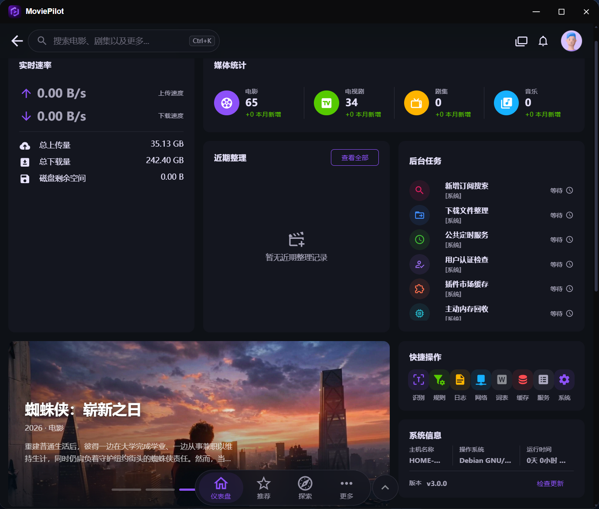

<p align="center">
  
</p>

<h1 align="center">MoviePilot for fnOS</h1>

<p align="center">飞牛 fnOS 原生封装的自动化媒体管理工具 · 订阅 / 搜索 / 下载 / 整理 / 刮削 / 通知 全自动</p>

<p align="center">
  <a href="https://github.com/bbsde/fn-native-moviepilot/releases/latest"></a>
  <a href="https://github.com/jxxghp/MoviePilot"></a>
  
</p>

---

[MoviePilot](https://github.com/jxxghp/MoviePilot) 是广受欢迎的自动化媒体管理工具；本项目把它以 **fnOS Native 原生进程**方式带到飞牛 NAS 上——非 Docker、非虚拟机，安装即用。订阅想看的剧集电影，剩下的搜索、下载、识别改名、刮削海报、入库、通知，全部自动完成。

<p align="center">
  
</p>
<p align="center"><sub>仪表盘：媒体统计 · 整理记录 · 后台任务 · 快捷操作</sub></p>

## 特性亮点

**📦 自包含离线安装**

安装包内置全部依赖：上游源码、前端、174 个 Python wheel（按目标平台锁定）、CloakBrowser 内核、站点资源。安装**无需外网、无需 SSH、无需 Python/Node 环境**，通常 1~5 分钟完成。

**🇨🇳 国内网络免代理可用**

对每个外部数据源做了真机实测与默认值调优，开箱即用不依赖任何代理：

| 数据源 | 状态 | 说明 |
| --- | --- | --- |
| TheMovieDb | ✅ 直连 | 默认走官方别名域名（0.7s 响应） |
| 豆瓣 | ✅ 直连 | 原生可用 |
| AniList | ✅ 直连 | 官方 API 直连，中文数据集走加速 |
| Bangumi | ✅ 默认镜像 | 官方域名被双重封锁，默认社区镜像，可一键换回 |
| 插件市场 / GitHub | ✅ 默认加速 | 镜像地址可更换或清空回退直连 |

**🔧 打包层修复的上游缺陷**

- 重启不再强制重新登录（登录态持久化）
- 媒体服务器等配置修改后**即时生效**，无需重启应用
- 首次安装的账号初始化崩溃已修复

**🐱 飞牛深度整合**

- 桌面图标打开**自动免登录**直进管理界面（局域网直连 3000 端口仍可手动登录）
- 自带**飞牛影视**媒体服务器对接，整理完成的媒体自动同步媒体库（也支持 Emby / Jellyfin / Plex）
- 配置与数据落在共享区，文件管理器可直接查看管理

## 安装

**[→ GitHub Releases（始终指向最新版）](https://github.com/bbsde/fn-native-moviepilot/releases/latest)**

| 架构 | 直连下载 | 加速下载（国内推荐） |
| --- | --- | --- |
| x86 | [moviepilot_3.0.0.9_x86.fpk](https://github.com/bbsde/fn-native-moviepilot/releases/download/v3.0.0.9/moviepilot_3.0.0.9_x86.fpk) | [ghproxy.net](https://ghproxy.net/https://github.com/bbsde/fn-native-moviepilot/releases/download/v3.0.0.9/moviepilot_3.0.0.9_x86.fpk) |
| arm | [moviepilot_3.0.0.9_arm.fpk](https://github.com/bbsde/fn-native-moviepilot/releases/download/v3.0.0.9/moviepilot_3.0.0.9_arm.fpk) | [ghproxy.net](https://ghproxy.net/https://github.com/bbsde/fn-native-moviepilot/releases/download/v3.0.0.9/moviepilot_3.0.0.9_arm.fpk) |

> 加速前缀为公共镜像，失效时可直连或自行更换前缀；Release 附带 `.sha256` 校验值。
> 系统要求：fnOS ≥ 1.1.3100；依赖 nodejs_v24 运行时，安装时自动拉取。

**步骤**：应用中心 → 手动安装 → 选择对应架构 fpk → 向导中设置管理员账号密码（≥8 位，含字母/数字/特殊字符至少两类）→ 完成，桌面图标点开即用。

## 快速上手

1. **设定 → 服务**：添加下载器（qBittorrent / Transmission）
2. **设定 → 媒体服务器**：添加媒体服务器。飞牛影视地址填 `http://<NAS-IP>:5666`，账号密码为 fnOS 登录凭据
3. **设定 → 站点**：导入站点认证资源（支持 CookieCloud 同步）
4. **订阅**：添加想追的内容，或使用「豆瓣想看」等插件自动同步

## 更新

下载新版 fpk，应用中心手动安装**覆盖升级**——配置、账号、订阅全部保留，同版本依赖升级通常一分钟内完成。MoviePilot 网页内的自动更新已停用（在线更新会覆盖本封装内置补丁并破坏依赖锁定，fpk 是唯一安全更新通道）。

## 常见问题

- **升级会丢配置吗？** 不会，配置/数据库/账号均在共享区，覆盖升级原样保留。
- **添加目录时读不到 /vol1、/vol2 下的目录？** 应用以专用用户运行，需先授权：fnOS 应用设置 → MoviePilot →「配置访问权限」，勾选媒体库/下载目录。授权即时生效（无需重启），网页目录浏览器即可逐级点开。
- **网页里改了密码，桌面图标免登录失效？** 应用中心 → MoviePilot → 设置，在「网桥免登录账号」同步新密码。
- **不信任第三方镜像？** GitHub 加速在 设定→高级设置→网络 清空即可；Bangumi 镜像在 `config/app.env` 将 `BANGUMI_API_DOMAIN` 改回 `api.bgm.tv`（需自备网络环境）。
- **探索页某数据源转圈？** 首访有数秒中文数据加载属正常；镜像失效按上一条更换或清空回退直连。

## 工作原理

以 fnOS Native 框架封装 MoviePilot v3 的本地运行系统：

```
浏览器 → fnOS 统一网关 /app/moviepilot → Unix Socket → gateway-bridge.js（剥前缀/免登录注入）
      → 前端 :3000（Node/express）→ 后端 :3001（FastAPI）
```

- **安装**：`install_callback` 释放自包含 payload（源码+依赖+内核），离线装配 venv 并初始化账号
- **运行**：`cmd/main` 托管前后端进程与网关桥，登录密钥持久化、模块配置热重建
- **构建**：`scripts/assemble-payload.sh` 拉取上游 v3 tag，应用构建期补丁（上游缺陷修复 + 国内网络适配），连同锁定依赖打包为 payload；`build.sh` 完成最终 fpk（本地与 CI 同一入口）

## 从源码构建

```bash
# 依赖：fnpack、uv（pip install uv）、Node 24、Python 3.11
./build.sh                    # 默认：x86_64 + 上游最新 v3.x tag
./build.sh v3.0.0             # 指定上游 tag
MP_ARCHS="x86_64 aarch64" ./build.sh    # 双架构
MP_SKIP_ASSEMBLE=1 ./build.sh v3.0.0    # 复用已组装 payload，快速重打
```

环境变量：`MP_ARCHS`（架构）、`MP_APPVER`（版本，默认 `<上游三段>.1`）、`MP_UPSTREAM`（上游 tag）、`MP_SKIP_ASSEMBLE`（复用缓存）。

CI：`build-fpk.yml`（可复用构建）、`release.yml`（手动 dispatch：构建 → tag `v<appver>` → Release）。

## 仓库结构

```
fn-native-moviepilot/
├── src/                    # fnOS 应用包内容（打进 fpk）
│   ├── cmd/                #   生命周期脚本（install/upgrade/main/…）
│   ├── app/bin/            #   网关桥（gateway-bridge.js）等随包脚本
│   ├── app/ui/             #   桌面入口配置 + 图标
│   ├── config/ · wizard/   #   权限/资源声明 · 安装与配置向导
│   ├── manifest            #   应用元数据（版本、依赖、变更日志）
│   └── ICON*.PNG           #   应用图标
├── scripts/assemble-payload.sh   # payload 组装（上游拉取+补丁+依赖锁定+内核）
├── build.sh                # fpk 构建入口（本地/CI 单一路径）
├── docs/                   # 构建方案 · 发布帖等
├── dist/                   # 构建产物（.fpk + 校验，不入库）
└── build/ · cache/         # 组装工作区与上游缓存（不入库）
```

## 版本与日志

版本号 `<上游三段>.<打包段>`（如 `3.0.0.9`）。完整更新记录见 **[CHANGELOG.md](CHANGELOG.md)**。

## 致谢

- [jxxghp/MoviePilot](https://github.com/jxxghp/MoviePilot) 及上游贡献者
- [飞牛 fnOS](https://www.fnation.cn) Native 应用框架
- [Bangumi 番组计划](https://bgm.tv) · [Mirrox](https://bangumi.lol) 社区镜像

> 仅供学习交流；请支持正版，尊重版权。
